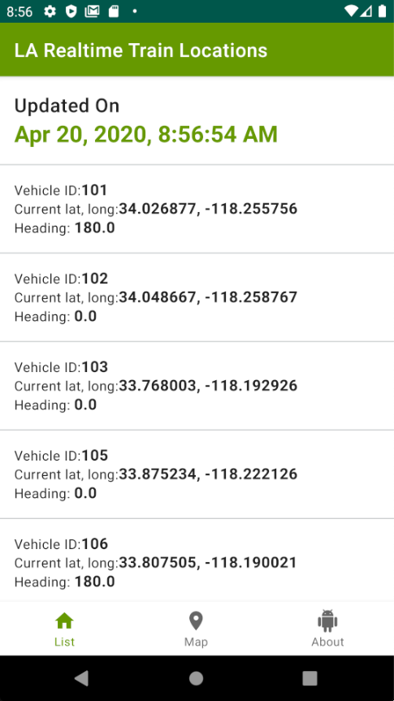
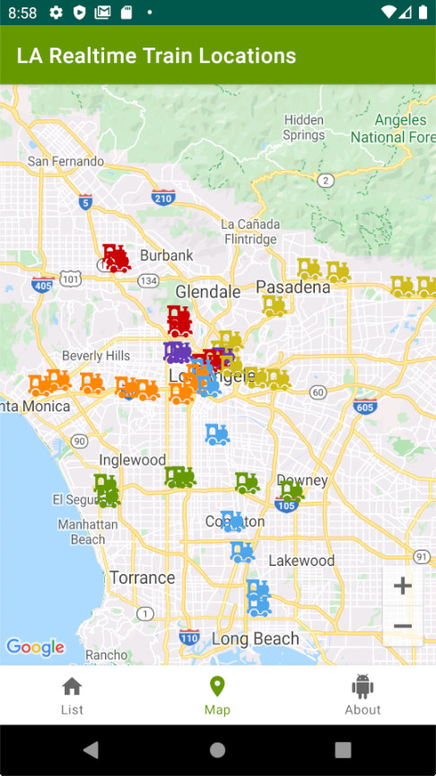

# Overview 🚀
This project illustrates my current set of Android best practices, tools, and solutions:

* 100% [Kotlin](https://kotlinlang.org/)
* Android MVVM architecture
* [Android Jetpack](https://developer.android.com/jetpack)
* Single-activity architecture, using the [Navigation component](https://developer.android.com/guide/navigation/navigation-getting-started)
* Dependency Injection
* Data repository with 2 levels of caching (RAM + SQLite DB)

# Thanks to
* Real-time vehicle location data provided by [LA Metro](https://developer.metro.net/)

# Technical Details 🛠
- [MVVM architecture](https://en.wikipedia.org/wiki/Model%E2%80%93view%E2%80%93presenter) - Facilitates automated unit testing and improves separation of concerns between UI and business logic
- [Data Repository](https://github.com/NYTimes/Store) - Manage data loading from RAM cache, local DB and remote REST API
- [SQLdelight](https://github.com/cashapp/sqldelight) - SQL is the language of choice for defining and using the local SQLite DB
- [Google Maps Android SDK](https://developers.google.com/maps/documentation/android-sdk/intro)
- [Dagger 2](https://github.com/google/dagger) - A fast dependency injector for Java and Android
- [Android Jetpack](https://developer.android.com/jetpack) - A suite of libraries, tools, and guidance to help developers write high-quality apps more easily
- [Material Design Components](https://material.io/develop/android/) - Google's implementation of the latest Material Design Components
- [Kotlin](https://kotlinlang.org/)
- [RxJava 2](https://github.com/ReactiveX/RxJava/tree/2.x) - To run code on background threads
- [Retrofit](https://square.github.io/retrofit/) - A type-safe HTTP client for Android and Java

# Out of Scope
TBD

# Tested With 🔬
TBD
